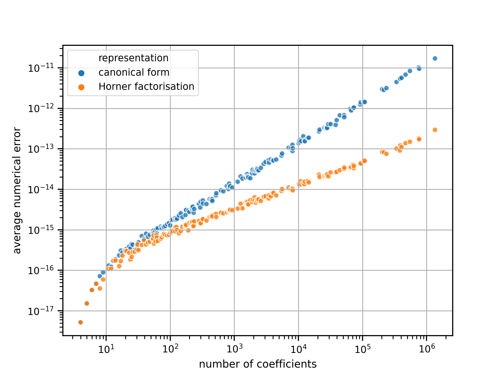
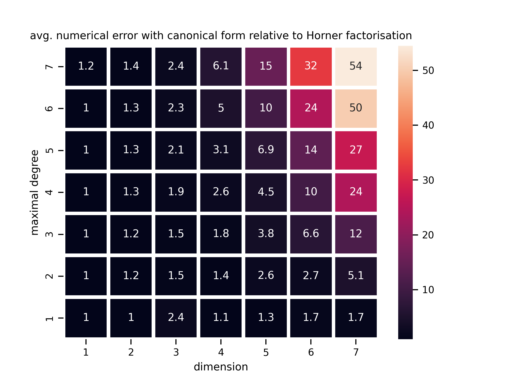
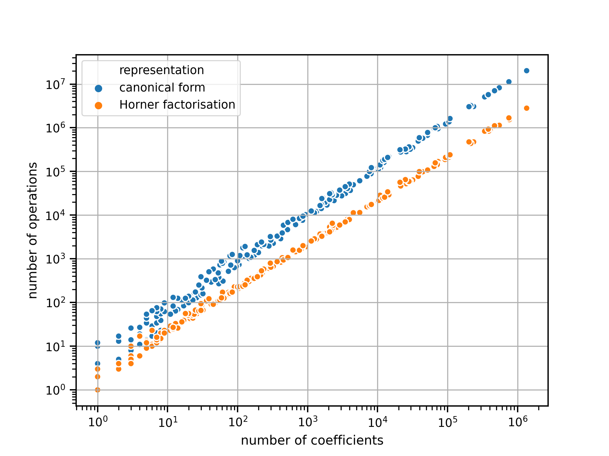

# Summary

Polynomials are a central concept in math and find application a wide range of fields and representing as well as evaluating (multivariate) polynomials in a computationally efficient way is relevant in many applications [@LeeFactorization2013; @leiserson2010efficient]

The `multivar_horner` Python package implements a multivariate Horner scheme ("Horner's method", "Horner's rule") [@horner1819xxi] and thereby allows computing Horner factorisations of multivariate polynomials.
Compared to the canonical form of polynomials this representation offers some important advantages.
The Horner factorisation is more compact in the sense that it requires less mathematical operations in order to evaluate the polynomial (cf. \autoref{fig:num_ops_growth}).
Because of this, evaluating a multivariate polynomial in Horner factorisation is faster and more numerically stable [@pena2000multivariate; @pena2000multivariate2; @greedyHorner] (cf. \autoref{fig:num_err_growth}).
These advantages come at the cost of initial computational effort required to find the factorisation.

Accordingly the package presented here can be helpful always when (multivariate) polynomials have to be evaluated efficiently, the numerical error has to be small or a compact representation of the polynomial is required.

# Functionality

In one dimension there is only a single possible Horner factorisation of a polynomial.
In the multivariate case however the factorisation is ambiguous as there are multiple possible factors to factorise with.
The key functionality of `multivar_horner` is finding a good instance among the many possible Horner factorisations of a multivariate polynomial.
This is achieved by recursively factorising with respect to the most commonly used factor in all monomials (greedy heuristic described in [@greedyHorner]).
When no leaves of the resulting binary "Horner Factorisation Tree" can be factorised any more, a computational "recipe" for evaluating the polynomial is being compiled.
This "recipe" encodes all operations required to evaluate the polynomial in numpy arrays [@numpy].
Functions just in time compiled by Numba [@numba] enable computationally efficient polynomial evaluation.

# Degrees of multivariate polynomials

It is important to note that in contrast to the one dimensional case, several concepts of degree exist for polynomials in multiple dimensions.
Following the notation of [@trefethen2017multivariate] the usual notion of degree of a polynomial, the maximal degree, is the maximal sum of exponents of all monomials.
This is equal to the maximal $l_1$-norm of all exponent vectors of the monomials.
Accordingly the euclidean degree is the maximal $l_2$-norm and the maximal degree is the maximal $l_{\infty}$-norm of all exponent vectors.
Refer to [@trefethen2017multivariate] for precise mathematical definitions.

A polynomial is called fully occupied with respect to a certain degree if all possible monomials having a smaller or equal degree are present.
The occupancy of a polynomial can then be defined as the amount of existing monomials relative to the fully occupied polynomial of this degree.
A fully occupied polynomial hence has an occupancy of $1$.

The amount of coefficients (equal to the amount of possible monomials) in multiple dimensions highly depends on the type of degree a polynomial has (cf. \autoref{fig:num_coeff_growth}).
This effect intensifies as the dimensionality grows.

# Benchmarks
     
To obtain meaningful results the benchmarks presented here use polynomials sampled randomly with the following procedure:
In order to draw polynomials with uniformly random occupancy, the probability of monomials being present is picked randomly.
For a fixed maximal degree $n$ in $m$ dimensions there are $(n+1)^m$ possible exponent vectors corresponding to monomials.
Each of these monomials is being activated with the chosen probability.

For each maximal degree up to 7 and until dimensionality 7, 5 polynomials were drawn randomly.
In order to compute the numerical error, each polynomial has been evaluated at the point of all ones.
The true result in this case should always be the sum of all coefficients.
The resulting numerical error is being averaged over 100 tries with uniformly random coefficients in the range $[-1; 1]$.

Note that even though the original monomials are not actually present in a Horner factorisation, the amount of coefficients however is identical to the amount of coefficients of its canonical form.

With increasing size in terms of the amount of included coefficients the numerical error of both the canonical form and the Horner factorisation found by `multivar_horner` grow exponentially (cf. \autoref{fig:num_err_growth})

In comparison to the canonical form however the Horner factorisation is much more numerically stable as it has also been visualised in \autoref{fig:num_err_heatmap}.

Even though the amount of operations required for evaluating the polynomials grow exponentially with their size irrespective of the representation, the rate of growth is lower for the Horner factorisation (cf. \autoref{fig:num_ops_growth}).
Due to this the bigger the polynomial the more compact the Horner factorisation representation is relative to the canonical form.
As a result the Horner factorisations are computationally easier to evaluate.

These results demonstrate the advantages of multivariate Horner factorisations and show their relevance for numerous applications handling large polynomials.

# Related work

The package has been created due to the recent advances in multivariate polynomial interpolation [@Hecht1; @Hecht2].
High dimensional interpolants of large degrees created the demand for evaluating multivariate polynomials computationally efficient and numerically stable.

Instead of using a heuristic to choose the next factor, one can allow a search over all possible Horner factorisations in order to arrive at a minimal factorisation.
The amount of possible factorisations, however, is increasing exponentially with the degree and dimensionality of a polynomial (the amount of monomials).
One possibility to avoid computing each factorisation is to employ a version of A-star search [@hart1968formal] adapted for factorisation trees.
This approach, which is similar to the branch-and-bound method suggested in [@kojima2008efficient, ch. 3.1], has been implemented by `multivar_horner`.

[@carnicer1990evaluation] shows how factorisation trees can be used to evaluate multivariate polynomials and their derivatives.

In [@kuipers2013improving] Monte Carlo tree search has been used to find more performant factorisations than with greedy heuristics.

# Further reading

The documentation of the package is hosted on [readthedocs.io](https://multivar_horner.readthedocs.io/en/latest/).

Any bugs or feature requests can be issued on [GitHub](https://github.com/MrMinimal64/multivar_horner/issues) [@github].
The [contribution guidelines](https://github.com/MrMinimal64/multivar_horner/blob/master/CONTRIBUTING.rst) can be found there as well.

# Acknowledgements

Thanks to Michael Hecht and Steve Schmerler for valuable input enabling this publication.

TODO Reviewer and editor contributions, like any other contributions, should be acknowledged in the repository.

# References
